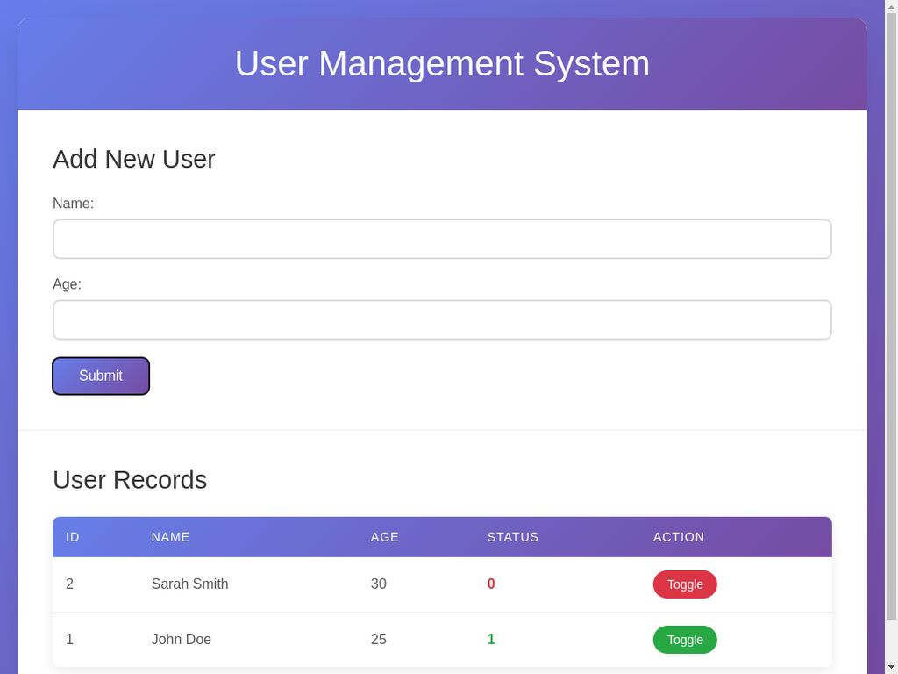

# User Management System

A complete web application built with HTML, CSS, JavaScript, PHP, and MySQL that allows users to manage a database of users with toggle functionality.

## Features

- **Add New Users**: Simple form to add users with name and age
- **Display Users**: Table showing all users with their information
- **Toggle Status**: Each user has a status (0 or 1) that can be toggled with a button
- **Real-time Updates**: Status changes are reflected immediately on the webpage
- **Responsive Design**: Works on both desktop and mobile devices

## Technologies Used

- **Frontend**: HTML5, CSS3, JavaScript (ES6+)
- **Backend**: PHP 8.1
- **Database**: MySQL 8.0
- **Web Server**: Apache 2.4





```

## Database Schema

The application uses a MySQL database with the following table:

```sql
CREATE TABLE users (
    id INT AUTO_INCREMENT PRIMARY KEY,
    name VARCHAR(255) NOT NULL,
    age INT NOT NULL,
    status INT DEFAULT 0
);
```

## Setup Instructions

1. **Database Setup**:
   ```bash
   sudo mysql -e "CREATE DATABASE IF NOT EXISTS web_app_db;"
   sudo mysql -e "USE web_app_db; CREATE TABLE IF NOT EXISTS users (id INT AUTO_INCREMENT PRIMARY KEY, name VARCHAR(255) NOT NULL, age INT NOT NULL, status INT DEFAULT 0);"
   ```

2. **Web Server Setup**:
   ```bash
   # Copy files to web directory
   sudo cp -r * /var/www/html/
   sudo chown -R www-data:www-data /var/www/html/
   
   # Start services
   sudo service mysql start
   sudo service apache2 start
   ```

3. **Access the Application**:
   Open your browser and navigate to `http://localhost/index.html`

## Usage

1. **Adding Users**: Fill in the name and age fields, then click "Submit"
2. **Viewing Users**: All users are displayed in the table below the form
3. **Toggling Status**: Click the "Toggle" button next to any user to switch their status between 0 and 1
4. **Real-time Updates**: The table updates automatically after any changes

## API Endpoints

- `POST /php/insert.php` - Add a new user
- `GET /php/fetch.php` - Get all users
- `POST /php/toggle.php` - Toggle user status

## Features Implemented

✅ HTML form with name and age fields  
✅ Submit button functionality  
✅ MySQL database integration  
✅ Display all records in a table  
✅ Toggle button for each record  
✅ Real-time status updates  
✅ Responsive design  
✅ Error handling  
✅ Input validation  


## License

This project is open source and available under the MIT License.

